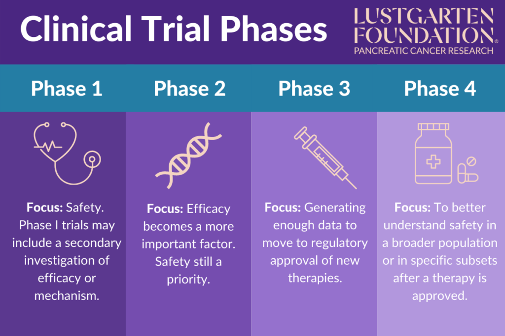
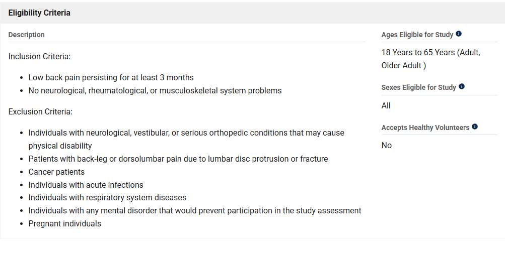
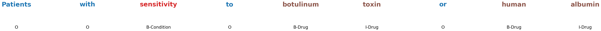
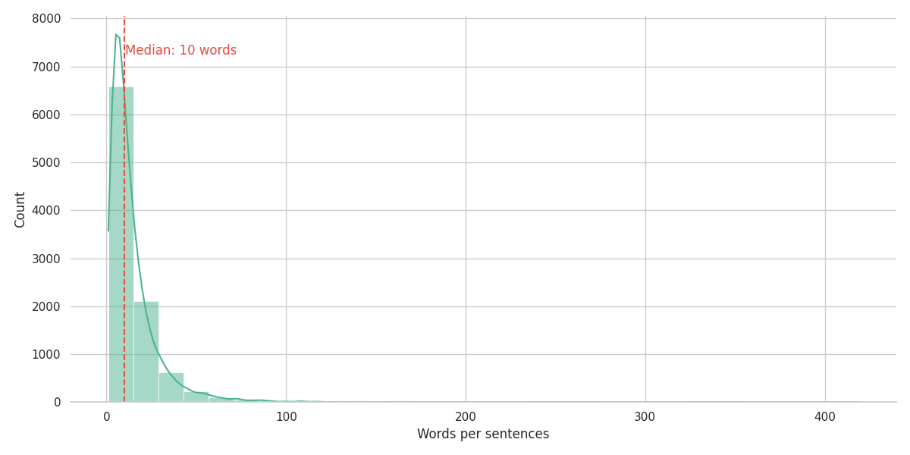
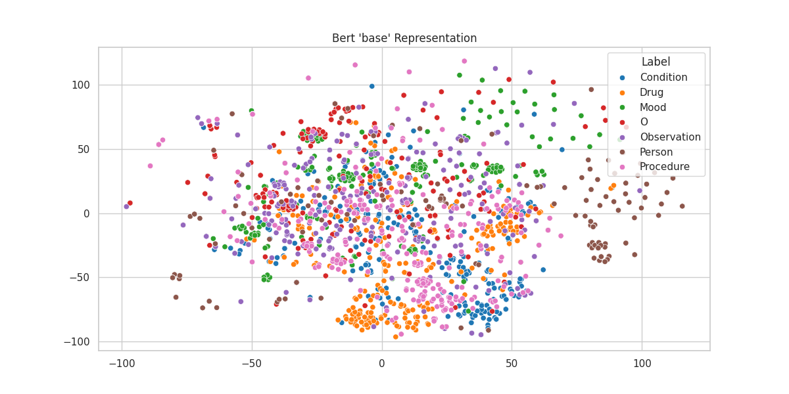
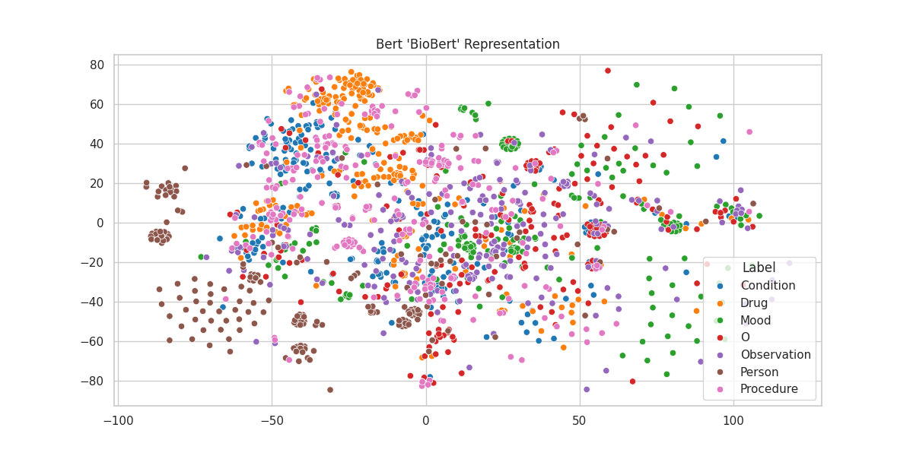
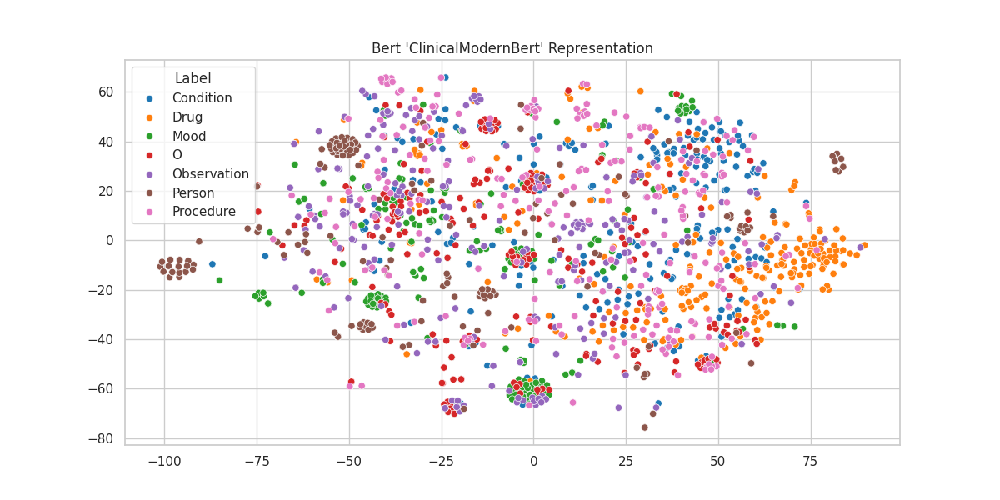

# Dataset

We are working with a clinical dataset. To briefly summarize, any drug or treatment must undergo a series of verifications and tests before it can be approved for commercial use. Clinical trials represent the different testing phases that a treatment must go through. As illustrated in the figure below, several stages are required before a treatment can be validated.

To conduct these trials—whether on a small or large scale—research laboratories need to recruit patients who meet specific medical and demographic conditions. The data we are using is derived from the eligibility criteria of various clinical trials. These criteria can be found on the following [website](https://clinicaltrials.gov/) and looks like this:

We downloaded an annotated dataset (see the details in ``data/``) for **Named Entity Recognition**. The dataset is annotated in a *BIO-format*, meaning that we add an extra tag:

* **B**eginning: Assigned to the first word/token of an entity
* **I**inside: Assigned to all the words/tokens inside the entity (except the first word/token)
* **O**utside: Assigned to words/tokens that do not belong to an *specific* entity, so it depends on the domain and application. 

The BIO format offers clear boundaries for entities, marking the beginning (B) and continuation (I) of multi-word entities, while using "O" for non-entity words. It is flexible, simple to implement, and ensures easy extraction of entities. This format helps avoid ambiguity.

The figure bellow shows an example of an annotated sentence in our dataset

And we have them in a tabular format:

|   sentence | Mot       | Label       |
|-----------:|:----------|:------------|
|          3 | Subject   | O           |
|          3 | has       | O           |
|          3 | curettage | B-Procedure |
|          3 | for       | O           |
|          3 | retained  | B-Condition |
|          3 | product   | I-Condition |
|          3 | after     | O           |
|          3 | second    | O           |
|          3 | trimester | O           |
|          3 | abortion  | B-Procedure |

In the training dataset, we have 9738 different sentences. Each sentence correspond to a line in an eligibility criteria. As we can see with the following figure, most of the sentence are short. Half of the sentences contains less than **10** tokens and the longest sentence contains **419** tokens. The whole training set contains **137744** tokens (which is few for a NLP problem).

Since we only focus on specific medical terms (we are not interested in tagging a word as "verb" or "noun") the labels are heavily unbalanced

| Label       |   Pourcentage (%) |
|:------------|------------------:|
| O           |             74.59 |
| Condition   |             13.7  |
| Procedure   |              4.34 |
| Drug        |              3.71 |
| Observation |              1.94 |
| Person      |              1.07 |
| Mood        |              0.65 |

| Label   |   Pourcentage (%) |
|:--------|------------------:|
| O       |             74.59 |
| I       |             13.22 |
| B       |             12.18 |

---

### Word Representation

All the point of using a Bert Model is to start with a consistent representation for each tokens. In our case, since most of the term are medical related, we may think that a Bert model trainer on a medical corpus will be more pertinent. To see that, we can take a model, project n tokens of each labels with the model, and visualize the embedding with a TSNE projection:

* Bert Base

* Bio Bert

* Modern Bert

* Clinical Modern Bert

